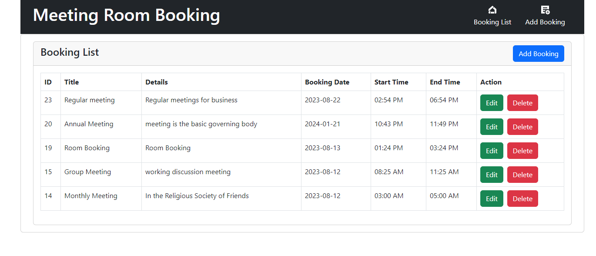

# Booking System
A common meeting room, which can be pre-booked for booking as a time slot method.(Php, laravel, vue js booking system)




## Installaton this project
#### laravel command
```sh
composer update
```
Update `.env ` file Information

```sh
php artisan migrate
```
#### Vue js command
This template should help get you started developing with Vue 3 in Vite.
```sh
npm install

```

#### Run command
```sh
php artisan serve
npm run dev

```
## Contributing

Thank you for considering contributing to the Laravel framework! The contribution guide can be found in the [Laravel documentation](https://laravel.com/docs/contributions).

## Code of Conduct

In order to ensure that the Laravel community is welcoming to all, please review and abide by the [Code of Conduct](https://laravel.com/docs/contributions#code-of-conduct).

## Security Vulnerabilities

If you discover a security vulnerability within Laravel, please send an e-mail to Taylor Otwell via [taylor@laravel.com](mailto:taylor@laravel.com). All security vulnerabilities will be promptly addressed.

## License

The Laravel framework is open-sourced software licensed under the [MIT license](https://opensource.org/licenses/MIT).
